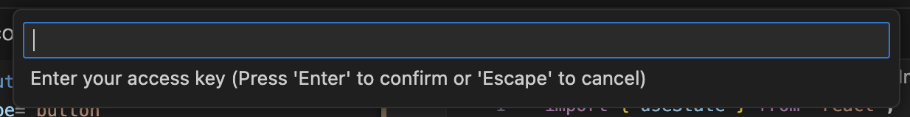

# VSCode GPT README

# Visual Studio Extension: One Stop Solution for Engineers and Architects

This Visual Studio extension is designed to enhance the productivity of engineers and architects by leveraging the power of OpenAI APIs. With this extension, users can access OpenAI APIs without worrying about their data privacy. The idea behind this plugin development is to ensure that user prompts are shared directly with the AI provider and no other third-party integration is used to train other models on your code.

## Features

- Ensure to retain the separate context of your chat history per project workspace (This helps engineers to work with separate projects without mixing the chat)
- Ensure to retain user's history context, recommended to not keep long history to avoid Max Token size limit for request/response payload
- API Access token is stored in encrypted form and it's not as part of extension settings
- You can create your own Encryption key to ensure further enhanced security for your access token
- Enhanced UI with capabilities like delete chat history and lot many options in Context Menu to work with working file
- Ensure data privacy by sharing user prompts directly with the AI provider. It access OpenAI APIs directly from Visual Studio to get responses for your prompts without any middleware or third party integrations to train other models on your codebase

## Requirements

This extension require a access token to use the OpenAI provider's APIs hence be aware on the usage and cost of the provided access token.

## Extension Settings

### Set-up your Access Key for AI Provider to used

To start conversation with VSCode GPT you need to provide your AI Provider Access Key by using below steps:

- Open command palette by pressing `Cmd/Ctrl+Shift+P`
- Search for `VSCode GPT` in the command palette to find all command available for extension
- Look for `VSCode GPT: Set Access Key` and select the command to set the access key
- You will see input box to enter the access key, paste the access key and hit `Return/Enter`. Please refer below screenshots:
  

This extension contributes the following settings for it's users:

- `VSCode GPT: Api Key`: Default: `OpenAI`: Allows you to select one the AI Provider.
- `VSCode GPT: Max Tokens`: Default: `800`: Allow you to change the max tokens to be used for API response.
- `VSCode GPT: Model Name`: Default: `gpt-3.5-turbo`: Allows you to change Model name used for your AI provider.
- `VSCode GPT: Temperature`: Default: `0.5`: Allows you to change the value for Temperature.
- `VSCode GPT: Top_P`: Default: `0.6`: Allows you to change the value for Top_P.

## Contributing

I'm are currently working on launching a microsite with a data privacy page. In the meantime, if you would like to enquire about project, please feel free to reach out to me at vscodegpt@gmail.com.

## License

This extension is licensed under the [MIT License](https://opensource.org/licenses/MIT).

## Known Issues

Not knows as of now unless I get from you

## Release Notes

### 1.0.0

Initial release of VSCode GPT
**Enjoy!**
