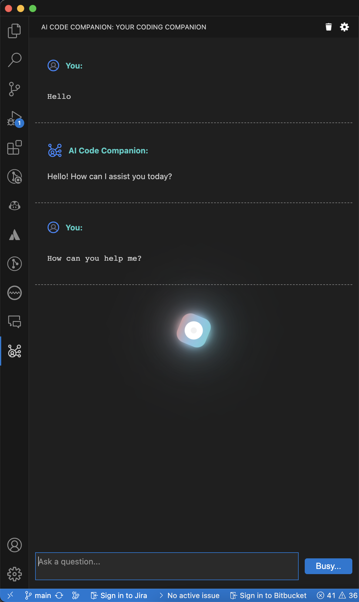
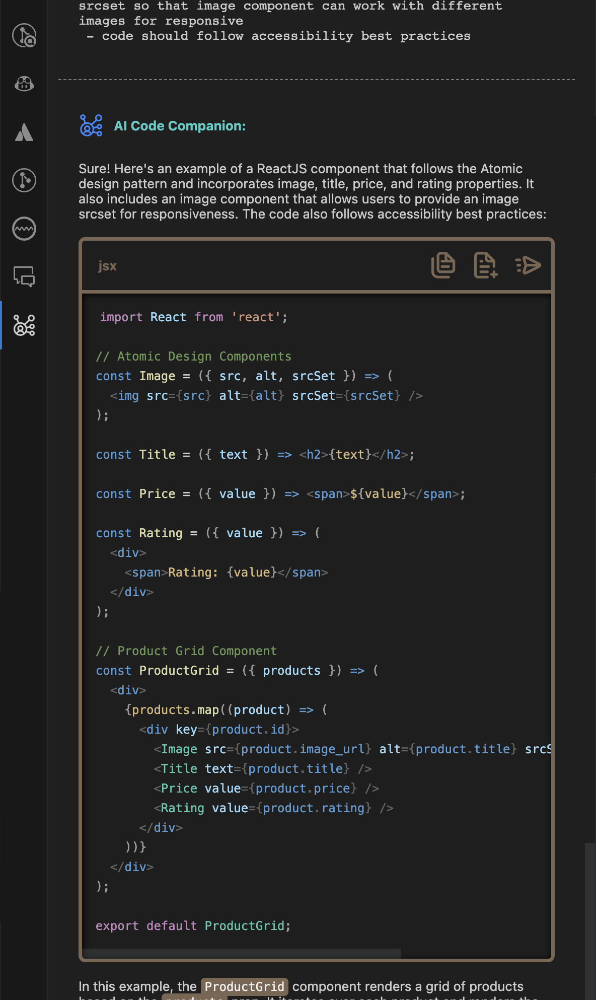

# `AI Code Companion` - Visual Studio Code Extension: One Stop Solution for Engineers and Architects

This Visual Studio extension is designed to enhance the productivity of engineers and architects by leveraging the power of OpenAI APIs. With this extension, users can access OpenAI APIs without worrying about their data privacy. The idea behind this plugin development is to ensure that user prompts are shared directly with the AI provider and no other third-party integration is used to train other models on your code.

## Usage

### Installation and Set-up
- Install the extension either by visiting Visual Studio Code [marketplace page](https://marketplace.visualstudio.com/items?itemName=vikash-bhardwaj.aicodecompanion) or search the extension in the "Extensions" activity bar tab with name "AI Code Companion" by vikash-bhardwaj
- Post installation please refer to the below [set-up section](#setup)

### Usage Screenshots
   

---

## Features

- Ensure to retain the separate context of your chat history per project workspace (This helps engineers to work with separate projects without mixing the chat context)
- Ensure to retain user's history context, when token usage is about to reach maximum token length (defined by extension setting `AI Code Companion: Model Max Tokens Length`) for provided model name it trims the messages by following FIFO logic - First in First Out
- API Access token is stored in encrypted form and it's not as part of extension settings
- If needed you can create your own Encryption key to ensure further enhanced security for your access token
  - To provide your Encryption Key, please create a file at root directory of your workspace with name `.aicodecompanion.config.js` and provide the Encryption Key like below
    ```javascript
    module.exports = {
      encryptionKey: "vscode2gpt112f9dbd8a37fe98421901",
    };
    ```
- Multiple options to interact with AI provider for asking questions and increase productity:
  - Context Menu Commands for quick access to common tasks like refactor code, find issues, explain and document code etc. Select the code in file and right click to access these commands. (refer below first screenshot).
  - Flexibility to write custom prompts/queries to ask AI Provider and same can be done to add more context for selected code in the editor. No need to switch to other windows as extension provides interactive approach to provide complex requirements for your code in the editor itself, just select the code and ask AI provider to achieve complex tasks like writing test cases, understanding the code, refactoring & optimizing the code with retained context in the chat history. (refer below second screenshot)
  - Flexibility to ask questions in form of inline code comments from editor:
    - You can use single line comments or multi line comments to provide prompts/queries. Please use keyboard shortcut `Ctrl+Alt+Enter/Return` from any line in the comment to executing the Inline prompts with `AI Code Companion`.
    - To keep the easy access to history for inline prompts, extension will add the responses to the chat window if it's in focus, if chat window is not in focus then the responses will be generated in new file.
    - Please note that Inline prompts are not maintained in AI Provider chat history and only maintained in chat window. Each inline prompt will be treated as new prompt to AI provider, this is to allow bigger prompts and leave space for maximum tokens to be used in responses.
    - Intutive approach to check the progress for Inline Prompts execution, you can check the status of API either with help of inline icon (&#8987;) or look for API progress in status bar. (refer third and fourth screenshot for refernce)

     

- Flexibility to provide different model names available with your AI Provider and other supported parameters by the AI Provider.
- Ensure data privacy by sharing user prompts directly with the AI provider. It access OpenAI APIs directly from Visual Studio to get responses for your prompts without any middleware or third party integrations to train other models on your codebase

## Requirements

This extension require a access token to use the OpenAI provider's APIs hence be aware on the usage and cost of the provided access token.

### <a name="get-your-key"></a>Where to get the access token/key?

- if you are using OpenAI Platform [platform.openai.com](https://platform.openai.com) then after login to the platform with your credentials visit to Manage Account section and look for "User" section and click on "[API Keys](https://platform.openai.com/account/api-keys)". Generate your new Access Token/Key for using with the extension.
- if you are using PSChat Platform then after login to the platform with your credentials visit to "Personal Access Tokens" section under developer section. Generate your new Access Token/Key for using with the extension.

## <a name="setup"></a>Set up your AI Provider Access Key for AI Code Companion to Communicate with AI Provider's API

To start conversation with AI Code Companion you need to provide your AI Provider Access Key by using below steps, please refer to [above section](#get-your-key) to find steps to get Access Key:

- Open command palette by pressing `Cmd/Ctrl+Shift+P` from Visual Studio Code
- Search for `AI Code Companion` in the command palette to find all commands available for extension
- Look for `AI Code Companion: Set Access Key` and select the command to set the access key. Please refer below screenshot:
  
- You will see input box to enter the access key, paste the access key and hit `Return/Enter`. Please refer below screenshots:
  Screenshot before entering access key:
  

  Screenshot post entering access key:
  

- If you want to remove your Access Key, then you can execute the command `AI Code Companion: Remove Access Key`. Please refer to below screenshot:
  

## Extension Settings

### This extension contributes the following settings:

#### Extension's settings screenshot:


#### Settings usage:

- `AI Code Companion: Api Key`: Default: `OpenAI`: Allows you to select one of the AI Provider from the predefined list.
- `AI Code Companion: Max Tokens`: Default: `800`: Allow you to change the max tokens to be used for API response.
- `AI Code Companion: Model Max Tokens Length`: Default: `4096`: Allow users to provide the maximum length of tokens allowed for the model in one request, going to be used for logic to trim chat history. Please look for the maximum tokens allowed for the AI model you are using
- `AI Code Companion: Model Name`: Default: `gpt-3.5-turbo`: Allows you to change Model name used for your AI provider.
- `AI Code Companion: Temperature`: Default: `0.5`: Allows you to change the value for Temperature.
- `AI Code Companion: Top_P`: Default: `0.6`: Allows you to change the value for Top_P.

## License

This extension is licensed under the [Mozilla Public License 2.0](https://www.mozilla.org/en-US/MPL/2.0/#:~:text=If%20a%20copy%20of%20the,org%2FMPL%2F2.0%2F.).

## Privacy Policy

[Link to Privacy Policy](https://vikash-bhardwaj.github.io/ai-code-companion-documentation/privacy-policy)

This extension collects certain data for the purpose of interacting with APIs provided by AI Provider selected by user, default AI provider is OpenAI. We are committed to protecting your privacy and handling your data securely. Please review our privacy policy for more information on how we collect, use, and protect your data. if you would like to enquire about project, please feel free to reach out to us at aicodecompanion@gmail.com.

## Known Issues

Not knows as of now unless I get from you

## Release Notes

### [1.1.0]

- Added support for older versions of VS Code, starting with 1.74.0.

### [1.0.0]

- Initial release of the extension

**Enjoy!**
