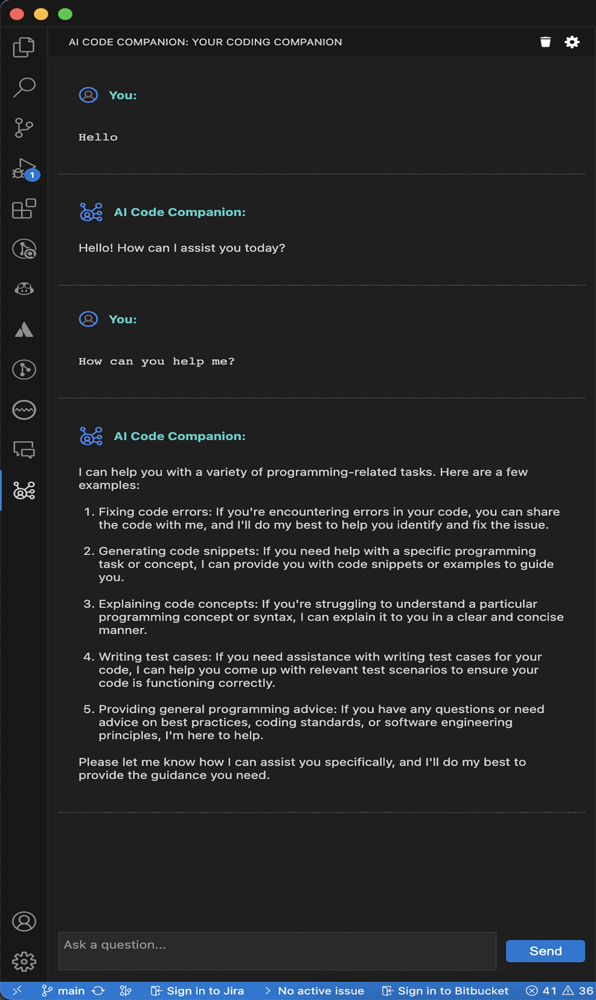
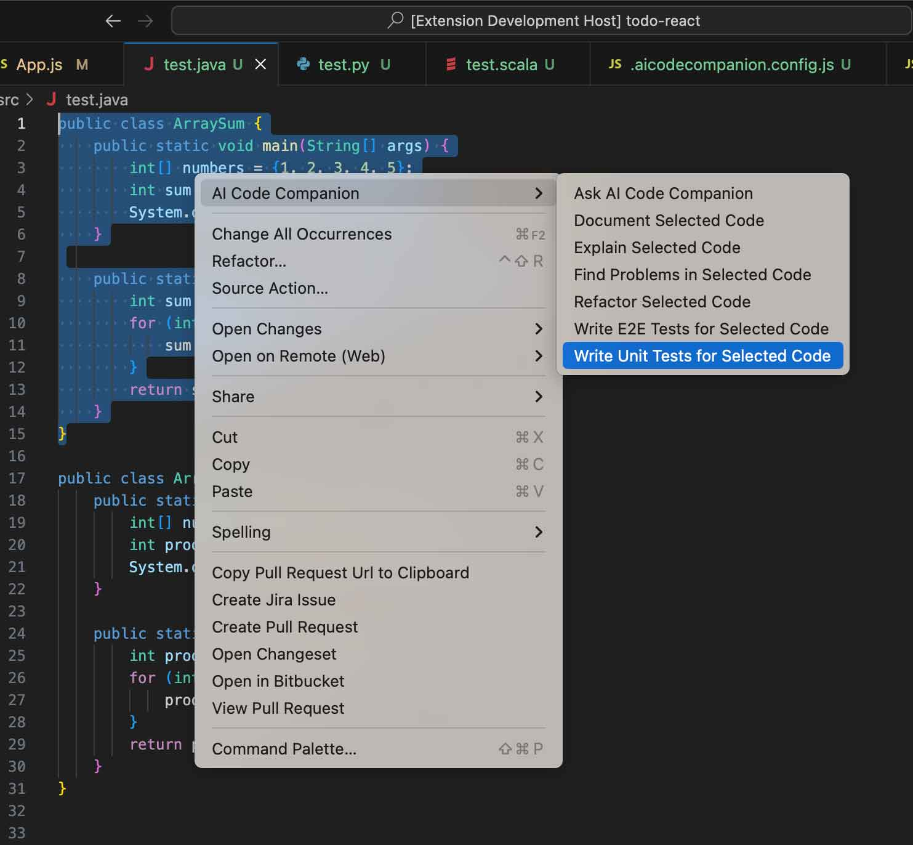
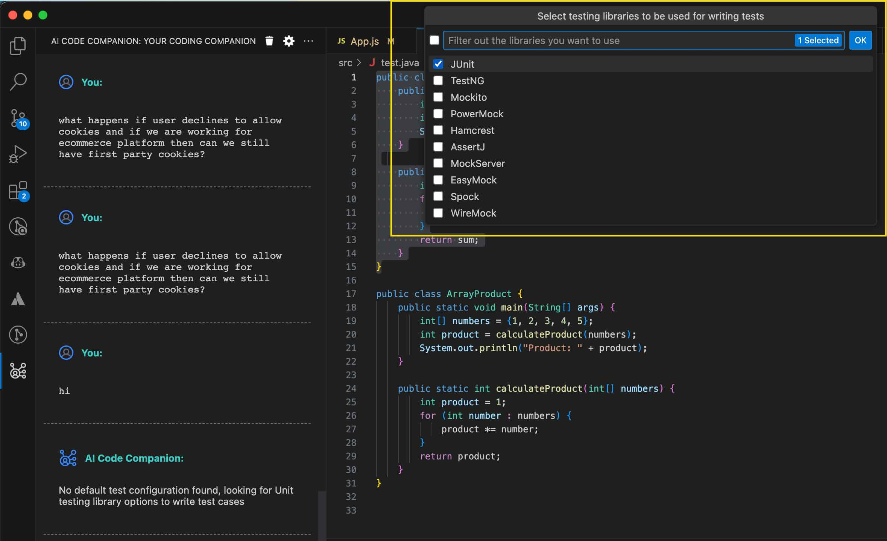

# `AI Code Companion` - Visual Studio Code Extension: One Stop Solution for Engineers and Architects

This Visual Studio extension is designed to enhance the productivity of engineers and architects by leveraging the power of OpenAI APIs. With this extension, users can access OpenAI APIs without worrying about their data privacy. The idea behind this plugin development is to ensure that user prompts are shared directly with the AI provider and no other third-party integration is used to train other models on your code.

## Usage

### Installation and Set-up

- Install the extension either by visiting Visual Studio Code [marketplace page](https://marketplace.visualstudio.com/items?itemName=vikash-bhardwaj.aicodecompanion) or search the extension in the "Extensions" activity bar tab with name "AI Code Companion" by vikash-bhardwaj
- Post installation please refer to the below [set-up section](#setup)
- <strong style="color: red">Important!!</strong> - Post setting up the accesskey for your selcted AI provider please ensure you also check the model name in the settings. If you are using `PSChat` as your AI Data Provider then please change the model name because default model name will not work as is with PSChat. While you can check the respective AI Provider docs for all model names provided by your AI Provider, you can use `gpt-3.5-turbo` or `gpt-3.5-turbo-16k` for OpenAI & `gpt35turbo` or `gpt4` For PSChat.
- For more details on how to set-up and use `AI Code Companion` and understand few usee cases please watch the Video: <br />
  <a href="https://www.youtube.com/watch?v=wmkSrL484V0" target="_blank"></a>

### Usage Screenshots

   

---

## Features

- Ensure to retain the separate context of your chat history per project workspace (This helps users to work with separate projects without mixing the chat context)
- Ensure auto trimming of user's history context to have seamless experience, when token usage for the API is about to reach maximum token length (defined by extension setting `AI Code Companion: Model Max Tokens Length`) for provided model name it trims the messages by following FIFO logic - First in First Out
- `Automated Code Reviews` for your `GIT` changes, with just one click of a button you can now review the changes in your GIT repository. `AI Code Companion` will go through all of your GIT changes(modified and added files) and provide you comments. You can play around this by running it multiple times to get different perspectives and improve code quality.
  - You can use this feature by two ways: Either with help of Button `Review GIT Changes and create notes for your PR` provided in the Extension Interface or by Running the Command for same from command palatte(refer below screenshots)
    <br /> 
- Multiple options to interact with AI provider for asking questions and increase productity:

  - Context Menu Commands for quick access to common tasks like refactor code, find issues, explain and document code etc. Select the code in file and right click to access these commands. (refer below first screenshot).
  - Flexibility to write custom prompts/queries to ask AI Provider and same can be done to add more context for selected code in the editor. No need to switch to other windows as extension provides interactive approach to provide complex requirements for your code in the editor itself, just select the code and ask AI provider to achieve complex tasks for selected code like writing test cases, understanding the code, refactoring & optimizing the code and this call gets further improved with retained context in the chat history. (refer below second screenshot)
  - Flexibility to ask questions in form of inline code comments from editor:

    - You can use single line comments or multi line comments to provide prompts/queries. Please use keyboard shortcut `Ctrl+Alt/Option+Enter/Return` from any line in the comment to executing the Inline prompts with `AI Code Companion`.
    - To keep the easy access to history for responses for inline prompts, extension will add the responses to the chat window if it's in focus, if chat window is not in focus then the responses will be generated in new file.
    - Please note that Inline prompts are not maintained in AI Provider chat history and only maintained in chat window. Each inline prompt will be treated as new prompt to AI provider, this is to allow bigger prompts and leave space for maximum tokens to be used in responses.
    - Intutive approach to check the progress for Inline Prompts execution, you can check the status of API either with help of inline icon (&#8987;) or look for API progress in status bar. (refer third and fourth screenshot for refernce)

      

- <a name="unit-test"></a>`AI Code Companion` has become smarter to write test cases for selected code using multiple approaches, users can write test cases for code with following options:
  - Users can select the code in editor and write Prompt in the available Input Textbox to write test cases
  - Users can also use Context Menu options to write test cases and extension gives full freedom to users for configuring the libraries to write test cases. See below options available for users when it comes to writing test cases using context menu commands:
    <br />  <br />
    1. Create a file at root of your project with name `.aicodecompanion.config.js` to define testing libraries for the project workspace for every programming language like below. You can also define your own custom prompt in case you dont like the prompt generated by the companion for you, see as an example for unitTests under javascript:
    ```
      module.exports = {
        testingLibraries: {
          javascript: { // this should match with language ID which is provided by VS Code Editor for the code snippet/file
            unitTests: {
              testingLibrary: "jest",
              additionalLibraries: ["react-testing-library"], // Optional
              promptMessage: "Write unit test cases for the code using RTL" // Optional: Only provide this if the prompt provided by extension is not working well for you
            },
            endToEndTests: {
              testingLibrary: "cypress",
              additionalLibraries: [
                "cypress-react-unit-test",
                "cypress-testing-library",
              ]
            },
          },
          python: {
            unitTests: {
              testingLibrary: "pytest",
              additionalLibraries: ["pytest-cov"],
            }
          }
          java: {
            unitTests: {
              testingLibrary: "junit"
            }
          }
        },
      };
    ```
    2. In case you don't provide the above config and still use the context menu then `AI Code Companion` is smart enough to recommend you the library names to pick from popular libraries for the given programming language. You will see below UI to pick the libraries and once you select the libraries it will remember the choices for future. You can reset the option by executing the command `Reset Testing Libraries Options for Unit and E2E Tests` using `cmd/ctr+shift+p` (refer second screenshot).
       <br />   <br />
- Flexibility to provide different model names available with your AI Provider and other supported parameters by the AI Provider.
- Provides intutive buttons with every codeblock in the AI responses for easily copying the codeblocks, creating new file with codeblocks or insert codeblocks at cursor position/selected code (refer below screenshot).
  <br />
- Users can Cancel the ongoing API request by multiple ways:
  - With help of `Cancel` button for chat prompts
  - With help of `Cancel Request` button from progress bar in the Statusbar
  - With help of `Abort Prompt API Request` command from `Command Pallete` (this will cancel both - any request created by chat prompts or request created by inline comments) (refer below screenshot)
    <br />
- API Access token is stored in encrypted form and it's not as part of extension settings
- If needed you can create your own Encryption key to ensure further enhanced security for your access token
  - To provide your Encryption Key, please create a file at root directory of your workspace with name `.aicodecompanion.config.js` and provide the Encryption Key like below
    ```javascript
    module.exports = {
      encryptionKey: "vscode2gpt112f9dbd8a37fe98421901",
    };
    ```
- Ensure data privacy by sharing user prompts directly with the AI provider. It access OpenAI APIs directly from Visual Studio to get responses for your prompts without any middleware or third party integrations to train other models on your codebase
- Provides easy approach to clear chat history (please note this will delete messages from chat along with maintained chat history for previous context)

## Requirements

This extension require a access token to use the OpenAI provider's APIs hence be aware on the usage and cost of the provided access token.

### <a name="get-your-key"></a>Where to get the access token/key?

- if you are using OpenAI Platform [platform.openai.com](https://platform.openai.com) then after login to the platform with your credentials visit to Manage Account section and look for "User" section and click on "[API Keys](https://platform.openai.com/account/api-keys)". Generate your new Access Token/Key for using with the extension.
- if you are using PSChat Platform then after login to the platform with your credentials visit to "Personal Access Tokens" section under developer section. Generate your new Access Token/Key for using with the extension.

## <a name="setup"></a>Set up your AI Provider Access Key for AI Code Companion to Communicate with AI Provider's API

To start conversation with AI Code Companion you need to provide your AI Provider Access Key by using below steps, please refer to [above section](#get-your-key) to find steps to get Access Key:

- Check if you have right AI provider selected in the extension settings, look for setting `AI Code Companion: Api Key` dropdown.
- If you have multiple AI provider and you want to use separate AI provider for different projects then please change the AI provider in the `Workspace` settings. Workspace settings will overwrite the user's settings.
- Open command palette by pressing `Cmd/Ctrl+Shift+P` from Visual Studio Code
- Search for `AI Code Companion` in the command palette to find all commands available for extension
- Look for `AI Code Companion: Set Access Key` and select the command to set the access key. Please refer below screenshot:
  
- You will see input box to enter the access key, paste the access key and hit `Return/Enter`. Please refer below screenshots:
  Screenshot before entering access key:
  

  Screenshot post entering access key:
  

- If you want to remove your Access Key, then you can execute the command `AI Code Companion: Remove Access Key`. Please refer to below screenshot:
  
- Please note that model names are different between OpenAI and PSChat AI Providers so please validate you have correct model name for selcted AI Provider

## Extension Settings

### This extension contributes the following settings:

#### Extension's settings screenshot:


#### Settings usage:

- `AI Code Companion: Api Key`: Default: `OpenAI`: Allows you to select one of the AI Provider from the predefined list.
- `AI Code Companion: Max Tokens`: Default: `800`: Allow you to change the max tokens to be used for API response.
- `AI Code Companion: Model Max Tokens Length`: Default: `4096`: Allow users to provide the maximum length of tokens allowed for the model in one request, going to be used for logic to trim chat history. Please look for the maximum tokens allowed for the AI model you are using
- `AI Code Companion: Model Name`: Default: `gpt-3.5-turbo`: Allows you to change Model name used for your AI provider.
- `AI Code Companion: Temperature`: Default: `0.5`: Allows you to change the value for Temperature.
- `AI Code Companion: Top_P`: Default: `0.6`: Allows you to change the value for Top_P.

## License

This extension is licensed under the [Mozilla Public License 2.0](https://www.mozilla.org/en-US/MPL/2.0/#:~:text=If%20a%20copy%20of%20the,org%2FMPL%2F2.0%2F.).

## Privacy Policy

[Link to Privacy Policy](https://vikash-bhardwaj.github.io/ai-code-companion-documentation/privacy-policy)

This extension collects certain data for the purpose of interacting with APIs provided by AI Provider selected by user, default AI provider is OpenAI. We are committed to protecting your privacy and handling your data securely. Please review our privacy policy for more information on how we collect, use, and protect your data. if you would like to enquire about project, please feel free to reach out to us at aicodecompanion@gmail.com.

## Known Issues

- Currently if an Inline Comment execution is in progress then another inline comment will not work at same time
- If Inline comment execution is in progress then Code Review for GIT changes will not work or vice versa

## <a name="release-notes"></a>Release Notes

### [1.4.0]

#### New Features:

- Added new context menu commands for developers to write test cases with just a single button click, ensured developers get full freedom to pick the libraries options their own rather than writing test cases with some generic library. For details refer to the features section for [writing test cases](#unit-test)
- Provided support for Light Theme as the code blocks were not clear for few languages in light theme
- Extended support for inline prompts using comments for other programming languages

#### Experience Improvements:

- Fixed an issue where the multi line comment was not working if it was not having a "\*" at starting of line

### [1.3.1]

#### Updated Readme:

- Updated Readme for adding details about Youtube Video published for how to install and few use cases around how you can use the `AI Code Companion`

### [1.3.0]

#### New Features:

- Added ability to review the code for all GIT Changes, please refer to updated features section for more details

#### Experience Improvements:

- Fixed the timeout issue
- Fixed a defect where inline code comments were not adding loading state if the comment was starting with line zero in the file
- Updated the Splash screen with important inoformation
- Updated the readme with feedback from users
- Fixed a defect where Inline Comments prompts were not working when the file was huge

### [1.2.0]

#### New Features:

- Added capability to use Inline Comments (both single and multi line comments) for asking AI Provider. Use keyboard shortcut `Ctrl+Alt+Enter/Return` from any line of your comment to ask questions. For progress bar/loading state please refer above features section
- Added capability to create new files from codeblocks
- Added capability to insert the code from codeblocks to working file
- Added capability to cancel the API requests, please refer above features section for more details

#### Experience Improvements:

- Ability to maintain the chatbox scroll position, in previous version it always used to scroll at the end of messages
- Ability to add line breaks in the Prompt Inputbox to change existing message, in previous version `Shift+Enter/Return` was always forcing cursor at the end of message but user should be able to edit the message to add line breaks anywhere and cursor will remain in focus too with line breaks.
- Increased the height for Inputbox
- Fixed the Send Button alignment for smaller viewports,send button gets shifted to next lien for smaller viewpport. In previous version button was getting cropped
- Fixed few defects

### [1.1.0]

- Added support for older versions of VS Code, starting with 1.74.0.

### [1.0.0]

- Initial release of the extension

**Enjoy!**
